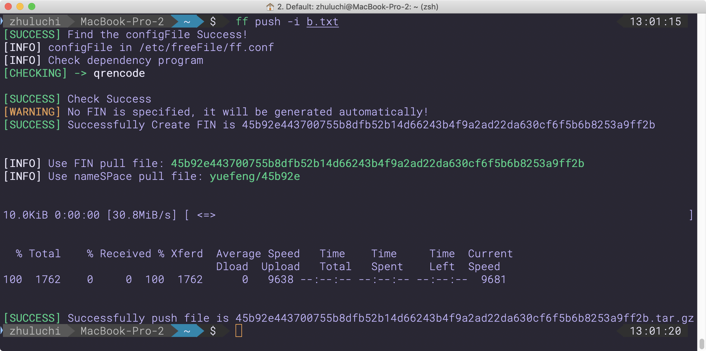
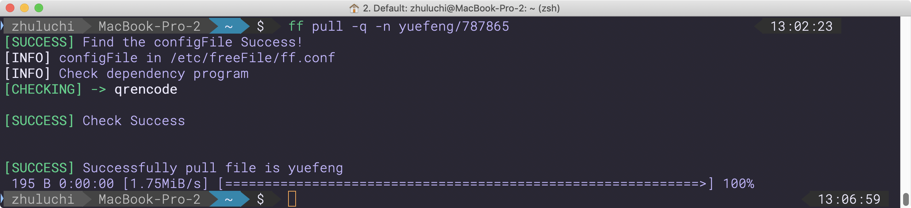

<div align="center">

# freeFile 📃

freeFile is still in the early development, if there is any doubt, please -> Issue.

freeFile 还在早期开发中, 如果使用有疑问, 请提起Issue.


</div>

--------------------------


freeFile is a terminal program designed to help quickly share a (s) file/directory across multiple computers.

Based on Python3 development, *it only runs on Unix-like operating systems for the time being.*


freeFile是一个旨在帮助在多台计算机中快速共享某个(s)文件/目录的terminal程序.

基于Python3开发, 暂时只运行于类Unix操作系统上.

未来将支持Windows系统, 并将兼容Python2.7.

建立在高效的对象存储[Object storage service] (minio)之上.


暂时不要将重要文件只保存在freeFileServer官方服务器上, 测试版的官方服务器可能会随时删除OSS上的数据!


Quickstart
===========

Add freeFile to your computer. The following example uses the default.

in OSS implementation for storage.


增加freeFile到你的设备上. 下面的例子将会教你简单地使用它


.. code-block:: bash

```bash
$ pip install pip -U 

$ sudo pip install --no-cache-dir freeFile

$ touch test.txt

$ ls
test.txt

$ ff push -i test.txt -n config

$ rm test.txt

$ ls

$ ff pull -n nickName/config

$ ls
test.txt


```


# USE


.. code-block:: bash

```bash
usage: ff [-h] [-i FILEPATH] [-n NAME] [-t TIME] [-e ENCRYPT] [-q] [-qr] [-nc]

Welcome to use freeFile! Please check the options currently supported by
freeFile

positional arguments:
  push                  Upload the file to the oss server
  pull                  Download files from oss server

optional arguments:
  -h, --help            show this help message and exit
  -i FILEPATH, --source FILEPATH
                        File location to upload
  -n NAME, --name NAME  Use FIN/nameSpace to Upload/Download files
  -t TIME, --time TIME  Set file expiration time
  -e ENCRYPT, --encrypt ENCRYPT
                        If you need a private access file/directory, please
                        give your gpg public key location
  -q, --quiet           Run freeFile quietly
  -qr, --qrcode         Need to output download QRcode
  -nc, --notcheck       Do not check dependencies

```


# Deploy private freeFileServer 


[Deploy private freeFileServer ](./private freeFileServer)


# Demo 






# Update 


### 更新日志:

1. 每个人都可以快速通过docker部署一个自己的freeFileServer节点

2. 同时freeFileClient开始接受用户接入自己的freeFileServer节点, 默认也可以接入官方freeFileServer节点

3. 使用自动生成的nameSpace/自动生成的FIN/指定的nameSpace来push/pull 文件 例如: ff pull -n yuefeng/config

4. 去掉强迫必须使用短横杠 -push/-pull  才能使用freeFileClient, 转而支持直接使用pull/push

5. 支持pull时输出qrcode下载码[-qr/--qrcode]

6. 支持初始化配置文件使用, 配置文件在/etc/freeFile/ff.conf, 可以手动删除/修改, 程序会重新初始化/自适应

7. 支持文件有效期-t/--time选项, 不过目前所有文件都不会被删除

8. 支持bin指令ff, 而不需要使用python freeFile.py 才能使用, 默认bin在/Library/Frameworks/Python.framework/Versions/3.6/bin/, 部分设备需要配置软链接到/usr/local/bin

9. 分离过耦合组件

10. 修复部分错误

11. 实现gitlab-ci对freeFileServer的持续集成

### 新的bug日志:

1. 初始化时有奇怪的curl输出, 但不影响使用
2. 千万别上传同名文件[自定nameSpace时], 否则会自动覆盖OSS中原版本文件!

### 下个目标:

1. 支持流文件传输
2. 加入freeFileServer限速功能
3. 实现对于freeFileServer的持续交付和持续部署[利用k8s的滚动更新]
